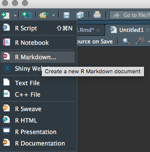
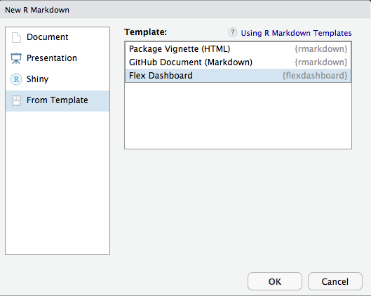
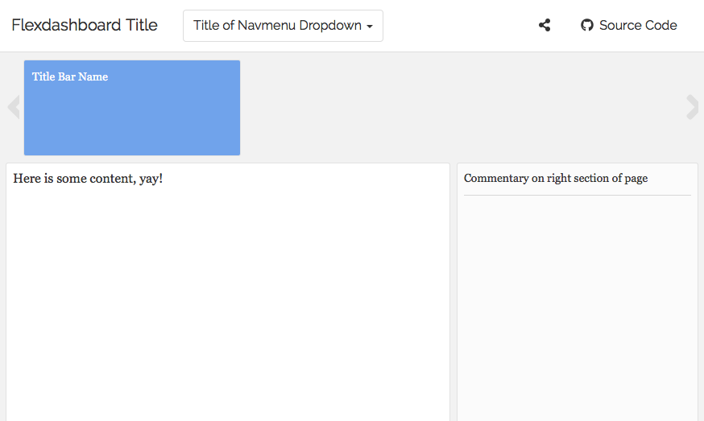
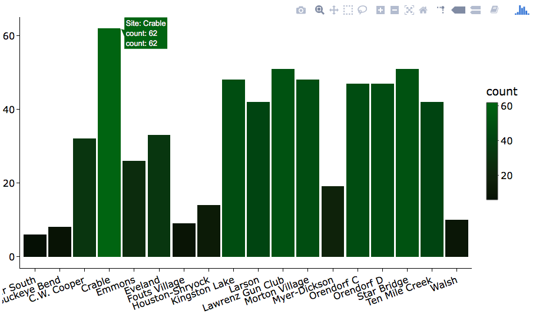
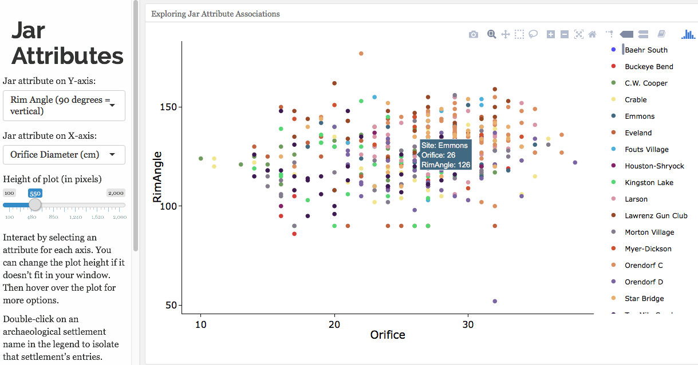

```{r setup, include=FALSE}
knitr::opts_chunk$set(echo = TRUE)
```

## Interactive Archaeology

When most folks think about archaeology, there is a tendency to think about an extinct human past. For example, viewing the artifacts of the archaeological world in museums often sanitizes them as being stuck in a static past and of no consequence to the human present. In an effort to breath life into our shared human heritage, I've endeavored to provide an interactive dashboard to my archaeological colleagues and the public alike. This post details the technical aspects of creating a creating such an interactive experience using Flexdashboard and Shiny in the R statistical language. The dashboard highlights a number of my personal interests in programming, including the creation of interactive social network models, interactive exploratory data analysis, and bringing statistical reports to an online format. By the end of this tutorial, you should have a solid foundation on how to build an interactive document using Shiny and Flexdashboard in R!

[Here is a direct link to the dashboard discussed in this post.](https://aupton.shinyapps.io/CeramicDashboard/)

[You can review the full source code for the dashboard here.](https://github.com/ajupton/Ceramic_Dashboard)


## Building a Dashboard with Flexdashboard

If you're more interested in statistical analysis than website design, [flexdashboards](https://rmarkdown.rstudio.com/flexdashboard/index.html) are a great way to gain entry into the online publishing world without much investment in learning a a bunch of new code or having to deal with hosting issues (you can host your flexdashboard on [ShinyApps.io](http://www.shinyapps.io/) at a free pricing tier). 

A good dashboard starts out with a good idea about presenting data, an analysis, or both. Maybe you want to allow a user to explore home prices in their area, look at sales data at different time scales, check the tide level, or (like the dashboard presented here) turn a static powerpoint presentation into an interactive online resource.   

The first step in RStudio is to create a fresh R Markdown document

 &nbsp;  

  
Using the flexdashoard template  

 &nbsp; 

This gives us a basic framework to create a flexdashboard. At the top of the R Markdown document is a YAML header we need to adjust to tell R this will be an interactive flexdashboard using Shiny. The YAML is denoted in between lines with three dashes "---". Change the output in between the dashed lines to:


```{r, eval = FALSE, include = TRUE}
title: "Title goes here"
output: 
  flexdashboard::flex_dashboard:
    storyboard: true
    social: menu
    source_code: "https://github.com/source_code_location"
    theme: readable
runtime: shiny
```

Many great dashboards consist of a single page. In fact, simplicity is often the best recipe depending on your audience. In this case, translating multiple slides and interactive graphs requires the use of multiple pages - something efficiently communicated using a storyboard. [Storyboards](https://rmarkdown.rstudio.com/flexdashboard/using.html#storyboards) are a great way to, just as the name suggests, tell a more expansive story with your dashboard. The interactivity comes from the integration of [Shiny](https://shiny.rstudio.com/). [Themes](https://rmarkdown.rstudio.com/flexdashboard/using.html#themes) are a super easy way to add some flair and appropriate formatting to your dashboard with a minimal amount of effort. Order and tabspace matters in the YAML header, so be carefule and don't be afraid to click Run Document to test things out. 

## Pages and Layout

With a storyboard format, you can add multiple pages using a level one markdown header ```==================```. Just put the title of the page above the header and you have the basics of your page ready. On each page, you can take advantage of the various layout options available to flexdashboards. These include the default columns, but these can be changed to rows, navmenues, sidebars, or more. Adjusting this is easy, just use curly brackets after the title of your page but above the markdown header. Like so, 

```{r eval = FALSE, include = TRUE}
## Rows instead of columns
Page Name - no quotes needed {data-orientation=rows}
===================================== 

## Add a navbar
Page Name {data-navmenu="Name of Dropdown Menu"}
=====================================
  
## Use a sidebar
Sidebar Title {.sidebar}
=====================================
```

New pages under a navmenu can be added easily by providing a distinct page name under the same navmenu. For example

```{r eval = FALSE, include = TRUE}
## Add a  new page to a navbar
Page Name 1 {data-navmenu="Name of Dropdown Menu"}
=====================================
  
Page Name 2 {data-navmenu="Name of Dropdown Menu"}
=====================================

```

For the storyboard I used, the default page layout includes multiple frames, or pages within each navmenu location. Each frame has a title bar where a title or more information about the frame can be provided and a main area where the content is displayed. Commentary can also be added quite simply by using a horizontal rule separators, or ```***```. 


```{r eval = FALSE, include = TRUE}

Title of Navmenu Page {.storyboard data-navmenu="Title of Navmenu Dropdown"}
======================================================================
### Title Bar Name
  
Here is some content, yay!
  
***
  
Commentary on right section of page

```


&nbsp;&nbsp;

One thing you may notice is that the Title Bars are a bit large. This can be good, but if you prefer to focus more on content, you can reduce the size of the Title Bar by adding some custom CSS. In this case, you can adjust the height parameter below and include the code at the bottom of your R Markdown document. 

```{r eval = FALSE, include = TRUE}
<style>

  .storyboard-nav .sbframelist {
        margin: 0 auto;
        width: 94%;
        height: 60px;
        overflow: hidden;
        text-shadow: none;
        margin-bottom: 8px;
    }

  .storyboard-nav .sbnext, .storyboard-nav .sbprev {
        float: left;
        width: 2%;
        height: 60px;
        font-size: 50px;
    }

</style>
```


## Adding Content

Now that the dashboard has a storyboard with navmenues, it's time to begin adding some substantive content. Since my flexdashboard tells a story originally told at a conference via powerpoint, it's useful to add in images in the different pages to set the scene.  

Images are easy to add by enclosing the image title or information about the photo in square brackets preceded by an exclamation point and the name of the image file in parenthesis. The exclamation point is used to differentiate the image from a weblink. Make sure the image file is saved in your dashboard's R working directory so it can be displayed. 

```{r eval = FALSE, include = TRUE}
## Display an image
 

## An example

```


Sometimes, line breaks aren't added after an image even if you add in spaces in the R Markdown code. You can resolve this by entering ```&nbsp;``` after the image. 

Of course, the true power of the flexdashboard is incorporating analytical code and the interactive power of Shiny. All code, whether R, Python, SQL, etc., needs to be wrapped in three grave accents and a curly bracket header. The hotkey to add in a new code chunk is "CMD + Option + I" on Mac, a hotkey I use all the time. Here is a codechunk (ignore the hashtags):

```{r eval = FALSE, include = TRUE}
#  ```{coding_language  name_of_code_chunk, additional args...}

# Enter some code heree

#  ```
```

Adding interactive content requires that ```runtime: shiny``` be included in the YAML header. As opposed to having to specify a UI and Server as with Shiny apps, interactivity can be added perhaps easier with a flexdashboard. Here is an example of an interactive histogram that uses Shiny and Plotly. 

```{r num_jars, fig.width = 20, fig.height=20, eval = FALSE, include = TRUE}
jhist <- jars %>%
          group_by(Site)%>%
            ggplot() + geom_histogram(aes(x = Site, fill = ..count..), stat = "count") + 
              theme(axis.text.x = element_text(angle = 20, hjust = 1)) + 
              ylab("") + 
              scale_fill_gradient2(low=("green4"), high="darkgreen", mid = 1) + 
              xlab("")

ggplotly(jhist)
```



Here is a good example of a more complicated interactive scatterplot that includes editable plot characteristics in the sidebar and the plot itself in the main content area. Note that the scatterplot is constructed using two different code chunks. The first chunk below renders the plot and the second chunk provides inputs. Because the plot is rendered with Plotly, the inputs provide additional interactivity beyond the interactive scatterplot itself. 

  
```{r jar_scatter_render, eval = FALSE, include = TRUE}
renderPlotly({
  
  #Build plot with ggplot syntax 
  pj <- ggplot(data = jars, aes_string(x = input$jx, y = input$jy, color = "Site")) +
          geom_point() +       
          theme(legend.title = element_blank()) + 
          scale_color_igv()

  ggplotly(pj) %>%
      layout(height = input$plotHeight, autosize = TRUE, legend = list(font = list(size = 12))) 
})
```
&nbsp; 

And under the sidebar, which is denoted with a ```---------```

&nbsp; 
```{r jar_scatter_input, eval = FALSE, include = TRUE}
headerPanel("Jar Attributes")

#Select variable for y-axis
 selectInput("jy", 
             label = "Jar attribute on Y-axis:", 
             choices = c("Orifice Diameter (cm)" = "Orifice",
                         "Lip Thickness (mm)" = "MaxLip",
                         "Thickness at Shoulder (mm)" = "MaxShoulder",
                         "Wall Thickness Below Shoulder (mm)" = "MaxWall",
                         "Rim Angle (90 degrees = vertical)" = "RimAngle",
                         "Cord-marking Thickness (mm)" = "MaxCM",
                         "Trailing Thickness (mm)" = "MaxTrailing"), 
              selected = "RimAngle")

#Select variable for x-axis
  selectInput("jx", 
             label = "Jar attribute on X-axis:", 
             choices = c("Orifice Diameter (cm)" = "Orifice",
                         "Lip Thickness (mm)" = "MaxLip",
                         "Thickness at Shoulder (mm)" = "MaxShoulder",
                         "Wall Thickness Below Shoulder (mm)" = "MaxWall",
                         "Rim Angle (90 degrees = vertical)" = "RimAngle",
                         "Cord-marking Thickness (mm)" = "MaxCM",
                         "Trailing Thickness (mm)" = "MaxTrailing"), 
              selected = "Orifice") 
  
#Slider for plot height
  sliderInput('plotHeight', 'Height of plot (in pixels)', 
                    min = 100, max = 2000, value = 550)
```
&nbsp; 
  &nbsp; 

Perhaps the most interesting aspect of the flexdashboard I created are interactive SNA graphs made with the threejs R package. Stay tuned for a future blog post covering the creation of those graphs. In the meantime, I hope you enjoyed this overview and tips & tricks for creating a storyboard flexdashboard. 

